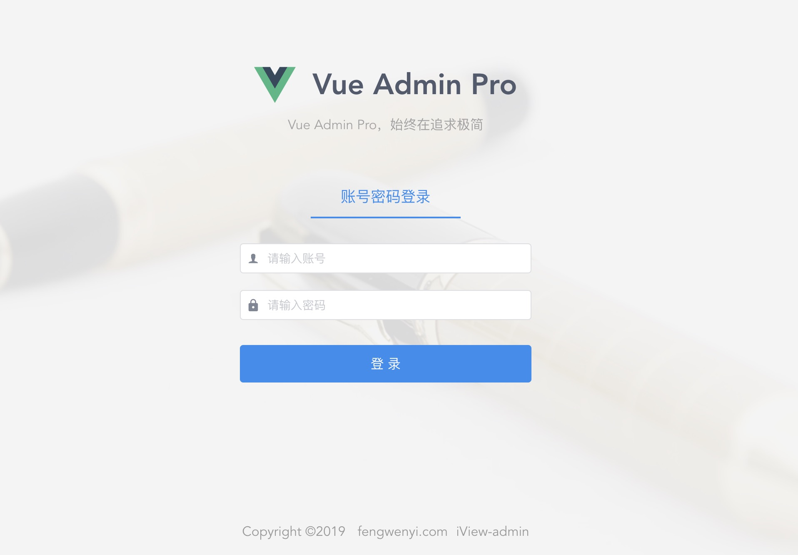

<h1 align="center">
  Vue Admin Pro
</h1>

<p align="center">
  <strong>基于iView-Admin，打造极简后端管理系统</strong>
</p>

Vue Admin Pro，这是一个简单的后端管理系统，适用于后端程序员写一写简单的后端管理系统，逻辑较简单，也不涉及权限只有简单的登录Token认证。

## 预览



## 登录

路径：

```
src/api/login.js
```

内容：

```javascript
import axios from '@/libs/api.request'

/**
 * 登录
 * @param account
 * @param password
 * @returns {http.ClientRequest | ClientHttp2Stream | * | never | AxiosPromise<any>}
 */
export const login = (account, password) => {
  const data = {
    account,
    password
  }
  return axios.request({
    url: 'auth/login',
    method: 'post',
    dataType: 'json',
    headers: {
      'Content-Type': 'application/json; charset=UTF-8'
    },
    data: data
  })
}

/**
 * 退出登录
 * @param token
 * @returns {http.ClientRequest | ClientHttp2Stream | * | never | AxiosPromise<any>}
 */
export const logout = (token) => {
  const data = {}
  return axios.request({
    url: 'auth/logout',
    method: 'get',
    dataType: 'json',
    headers: {
      'Content-Type': 'application/json; charset=UTF-8',
      'token': token
    },
    data: data
  })
}

```

接口写法

```java
import com.fengwenyi.vueadminproapi.entity.Login;
import net.iutil.ApiResult;
import org.springframework.http.MediaType;
import org.springframework.util.StringUtils;
import org.springframework.web.bind.annotation.*;

import java.util.HashMap;
import java.util.Map;
import java.util.UUID;

/**
 * 认证
 * @author Erwin Feng
 * @since 2019-06-08 10:21
 */
@RestController
@RequestMapping(value = "/auth",
        consumes = MediaType.APPLICATION_JSON_UTF8_VALUE,
        produces = MediaType.APPLICATION_JSON_UTF8_VALUE)
public class AuthController {

    @PostMapping("/login")
    public ApiResult login(@RequestBody Login login) {
        String account = login.getAccount();
        String password = login.getPassword();
        if (StringUtils.isEmpty(account))
            return ApiResult.error().setCode(10001).setMsg("账号不能为空");
        if (StringUtils.isEmpty(password))
            return ApiResult.error().setCode(10002).setMsg("密码不能为空");
        if (!account.equals("admin"))
            return ApiResult.error().setCode(10003).setMsg("账号不存在");
        if (!password.equals("admin@1234"))
            return ApiResult.error().setCode(10004).setMsg("密码不正确");
        Map<String, String> map = new HashMap<>();
        map.put("token", UUID.randomUUID().toString());
        map.put("uid", UUID.randomUUID().toString());
        return ApiResult.success(map);
    }

    @GetMapping("/logout")
    public ApiResult logout(@RequestHeader String token) {
        return ApiResult.success();
    }

}
```

## 接口示例

[vue-admin-pro-api](https://github.com/fengwenyi/vue-admin-pro-api)

## token

token格式推荐：`uid_token`

在API请求的时候如何携带发起请求？

如下示例：

```javascript
import axios from '@/libs/api.request'
import { getToken } from '@/libs/util'

export const data = (d1, d2) => {
  const data = {
    d1,
    d2
  }
  return axios.request({
    url: 'auth/login',
    method: 'post',
    dataType: 'json',
    headers: {
      'Content-Type': 'application/json; charset=UTF-8',
      'token': getToken()
    },
    data: data
  })
}
```

